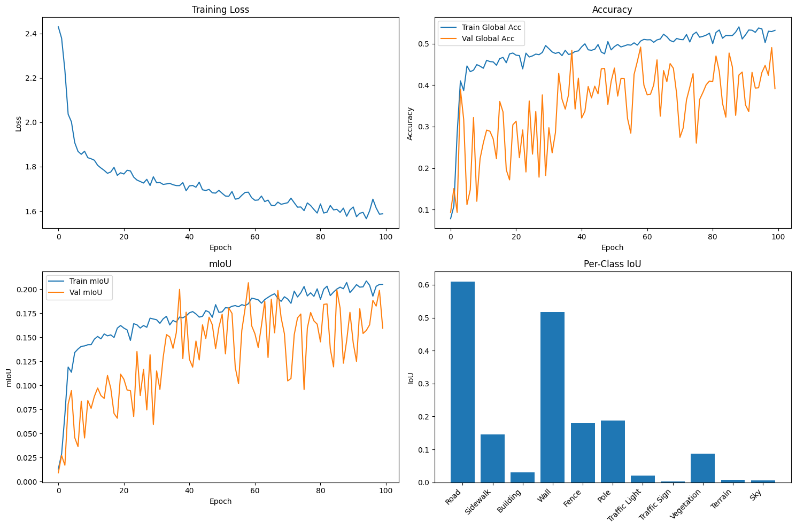

# Encoder-decoder vs Transformers

## Использованные статьи

- [SegNet: A Deep Convolutional Encoder-Decoder Architecture for Image Segmentation](https://ieeexplore.ieee.org/document/7803544)
- [SegFormer: simple and efficient design for semantic segmentation with transformers](https://dl.acm.org/doi/10.5555/3540261.3541185)

### 1. Сегментация с использованием SegNet

Реализована модель с энкодером (сверточная часть VGG16) и декодером (зеркален к энкодеру по количеству слоёв), описанными в статье, выполнено обучение на датасете CamVid, добавлены аугментации на тренировочном наборе

Итоговые результаты после 100 эпох обучения:  
Train Loss: 1.5880 | Global Acc: 0.5322 | mIoU: 0.2050  
Val Global Acc: 0.3913 | mIoU: 0.1595

Training completed in 62.46 minutes  
Average memory usage: 2.39 GB

Результаты тестирования:  
Global Accuracy: 0.4207  
Class Average Accuracy: 0.3097  
mIoU: 0.1634

### 2. Сегментация с использованием трансформеров (SegformerForSemanticSegmentation)

В качестве трансформера взят SegformerForSemanticSegmentation (MiT B0 в роли энкодера внутри модели, All-MLP Head в роли декодера)

Модель была предобучена сначала на ImageNet, затем на ADE20K семантической сегментации (за счёт загрузки весов segformer-b0-finetuned-ade-512-512)

Итоговые результаты после 100 эпох обучения на датасете CamVid:  
Train: Loss: 0.3920, Acc: 0.8660, mIoU: 0.4440  
Val: Loss: 0.2842, Acc: 0.9001, mIoU: 0.5372  
Best Val mIoU: 0.5383

Training completed in 29.10 minutes  
Average memory usage: 3.13 GB

Результаты тестирования:  
Acc: 0.8634  
mIoU: 0.4534

## Сравнение и выводы

По результатам тренировок моделей и сравнения результатов Segformer показал себя гораздо лучше, чем SegNet, при этом в среднем при использовании SegNet использовалось почти на 1GB меньше памяти:

SegNet/SegFormer
Train Loss: 1.5880/0.3920  
Train Accuracy: 53.22%/86.60%  
Train mIoU: 0.2050/0.4440  
Val Accuracy: 39.13/90.01%  
Val mIoU: 0.1595/0.5372  
Test Accuracy: 42.07%/86.34%  
Test mIoU: 0.1634/0.4534  
Train Time: 62.5 мин/29.1 мин  
RAM (avg):2.39 GB/3.13 GB

Обучение SegNet менее стабильно на валидации (наблюдаются резкие скачки на графиках), распознавание определённых классов так же различается сильнее (per-class IoU). Скорее всего, это произошло из-за добавления аугментаций, таких же, как для SegFormer, CNN недостаточно адаптировался к ним

SegFormer обучился быстрее, достиг в 3 раза больших показателей mIoU и показал более устойчивую работу
